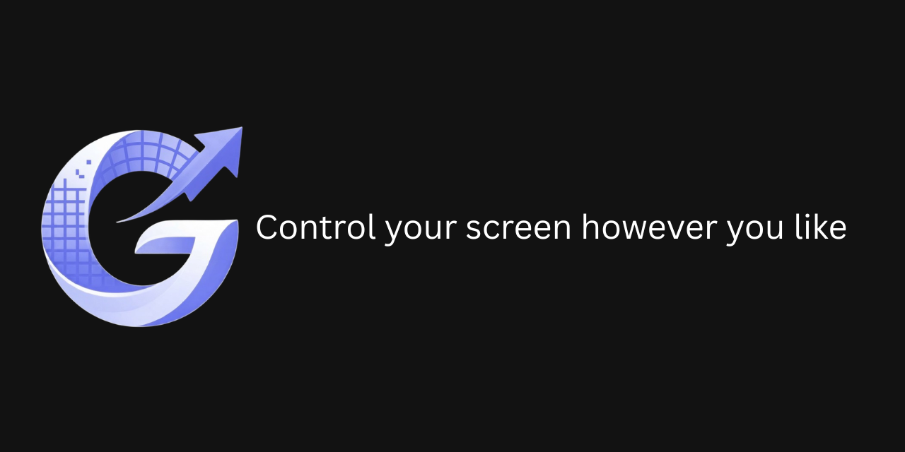

# G-Res
A tool for managing and switching display resolutions. It detects available monitor resolutions with their maximum refresh rates, allows quick resolution changes through a drop-down menu, and binds custom key combinations to switch to specific resolutions instantly.

  <a target="_blank" rel="noopener noreferrer" href="G-Res-Banner.png">
    
  </a>

## Interface

### Quick Switch
Quickly modify Windows resolution without compromising the highest available refresh rate.

### Hotkeys Manager
Assign a custom shortcut to automatically switch your display resolution, even while running a game, and use a dedicated hotkey to enable or disable the monitor directly.

### Settings
You can enable Run with startup from the settings tab to launch the app automatically with Windows.

## Features

* **Lightweight & Resource-Efficient:** Minimal CPU and RAM usage with zero performance impact.
* **Seamless Background Operation:** Runs quietly in the system tray for instant hotkey resolution switching.
* **Safe & Secure:** Built with clean, standard Windows APIs to ensure safe display adjustments without system conflicts.

## FAQ

* **Where can I download the latest version?**  
  You can head over to the [Releases](https://github.com/iiRG4/G-Res/releases) page and download the latest version to ensure the best experience and performance.

* **What Windows versions are supported?**  
  G-Res is fully compatible with **Windows 10** and **Windows 11**.

* **Does G-Res work while playing games in fullscreen?**  
  Yes, the hotkeys are global and will switch your resolution even while you are actively running a game.

* **How do I make the app start automatically with Windows?**  
  You can simply enable the **Run with startup** option directly from the settings tab.
